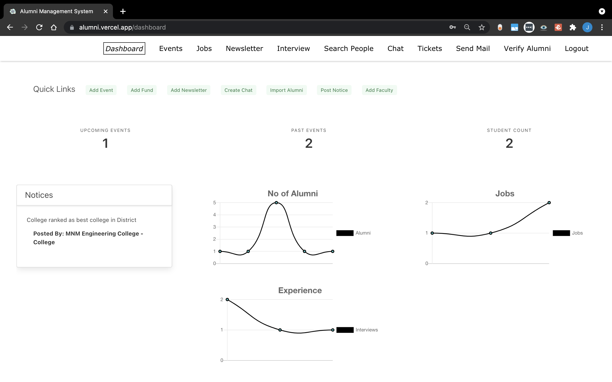
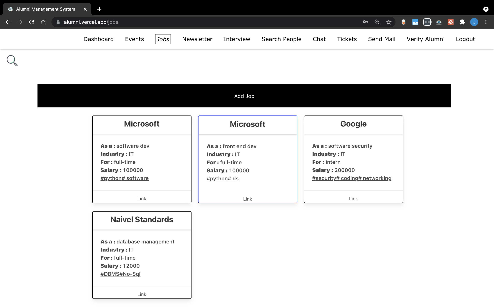
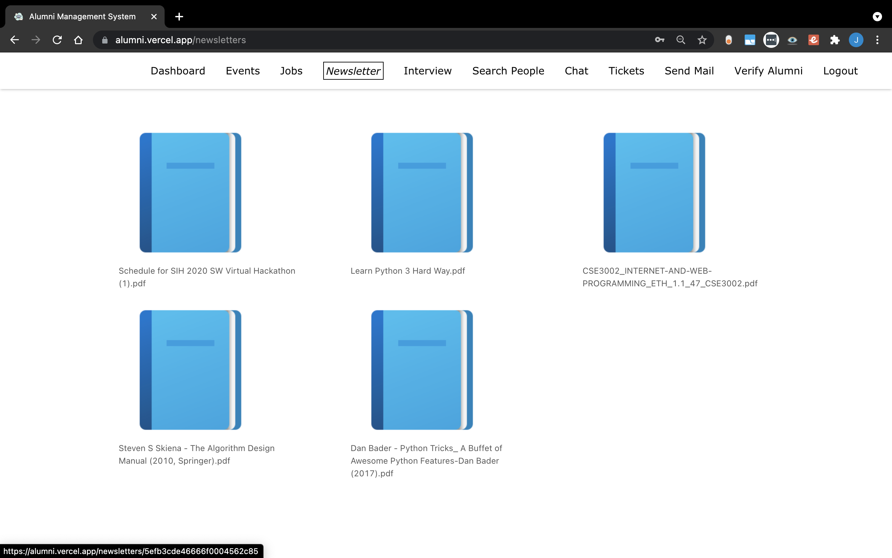
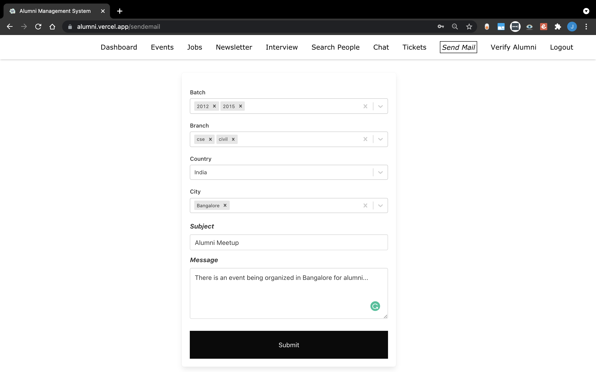
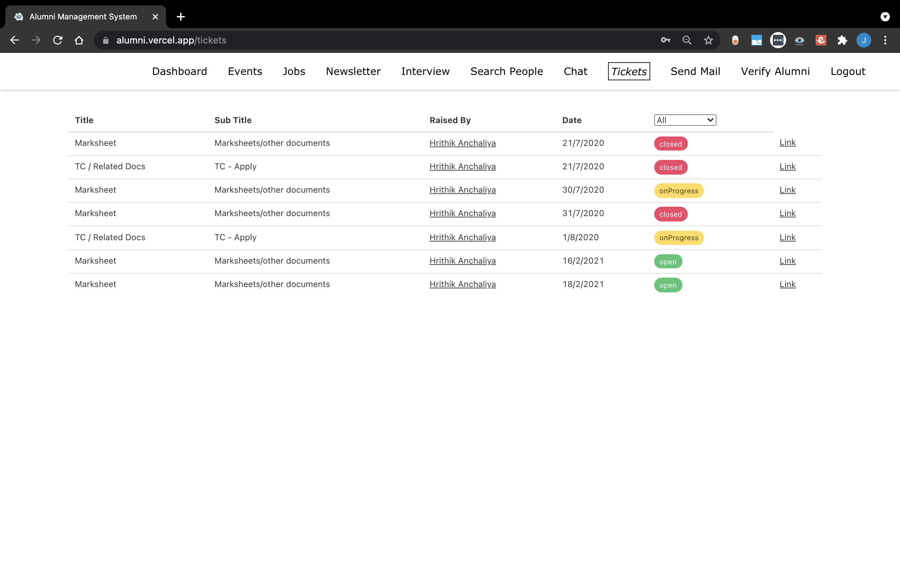

# AlumNite - Alumni Management System - Backend

Built a Project for Govt. of Goa as part of **Smart India Hackathon 2020 Finalist**.

- Involves 4 portals - University, College, Alumni, Student

## University/College features:

- Create Events
- Post Jobs for alumni
- Publish NewsLetters
- Create Notices with auto delete after expiry time
- Bulk import Alumni using Excel Sheets
- Powerful Search using various filters such as Name, year, batch, location
- Send email to targeted alumni (integrated with powerful search)
- DashBoard - View analytics using graphs
- Create real time chat rooms - Batch wise, year wise, interest specific groups, etc
- Raise Funds
- Add faculties
- Verify signed-up alumni
- Cater alumni needs using support tickets

## Alumni features:

- Register Events. View attendees
- Post/apply Jobs
- View NewsLetters posted by College/University
- View Notices
- Powerful search and view other alumni
- Use real time chat rooms (can access only their batch/year groups & interest specific groups)
- Raise support tickets (eg: Request TC, MarkSheets, etc)
- Post/view interview experiences

And a lot more...

## Tech Stack:

- NodeJs
- ExpressJS
- MongoDB
- Socket io

## Run locally

Clone the project

```bash
  npm install
  npm start
```

## Demo

https://alumni.vercel.app/

**College Portal** :
Email: mnm@gmail.com
Password: pwd

## Screenshots

#### Dashboard



#### Jobs Portal



#### Newsletters



#### Send Email Page



#### Support Tickets


